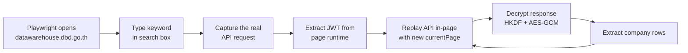
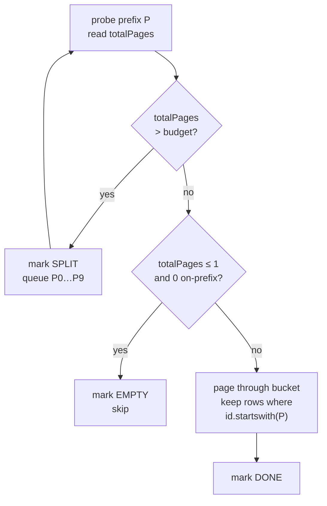
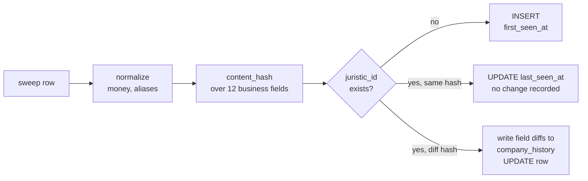
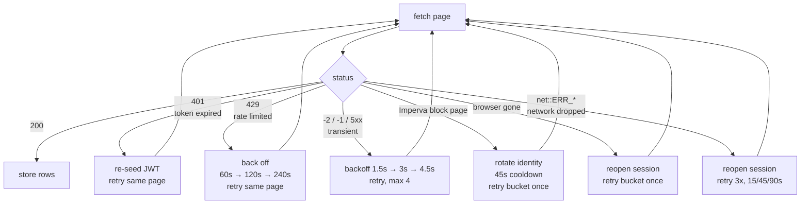

# How the DBD → CRM Pipeline Works

> Written 2026-09-16, during the first live run of the rebuilt pipeline.
> Covers: how the old process worked, what broke, how it was fixed, and how the
> current system works in detail.

---

## TL;DR

The old process (`f_main.py`) searched DBD for the keyword **`บริษัท`** ("company"),
which matched nearly every company in Thailand, then paged through 3,188 result
pages. On **2026-09-16** that stopped working: DBD now rejects that keyword
server-side with HTTP 400, *"กรุณาระบุคำค้นหาให้เฉพาะเจาะจงมากขึ้น"* (please be
more specific).

The replacement (`g_sweep.py`) searches by **juristic-ID prefix** instead —
`0105`, `0107`, `0115`… Every Thai company has exactly one 13-digit ID, so
sweeping all prefixes covers the registry exactly once, and coverage becomes
*provable* rather than guessed.

Results are now stored in **SQLite keyed on `juristic_id`** instead of a CSV that
was rewritten from scratch on every run.

---

## 1. The old process, and why it worked at all

DBD DataWarehouse is a JavaScript app behind Imperva (anti-bot). Its company-list
endpoint returns **encrypted** payloads. Process `f` solved this with a hybrid
approach that is still the foundation of the new system:



Three ideas make it work, and all three were kept:

1. **Drive a real browser.** Direct HTTP calls lose the Imperva session and the
   challenge state. Playwright keeps them.
2. **Replay the API from inside the page** (`page.evaluate` + `fetch`). This
   inherits the browser's cookies and challenge context, which a raw HTTP client
   cannot. It is also ~10× faster than clicking through the UI.
3. **Decrypt locally.** The API returns `{kid, salt, iv, ct}`. The page's JWT
   carries an `encKey` claim; HKDF derives the key, AES-GCM decrypts the payload.

What changed is only **where the list of companies comes from** — the seed.
Everything downstream (capture → replay → decrypt → extract) is unchanged and was
re-verified working today.

---

## 2. What broke

Five problems. Two were inherited design flaws; three were bugs found by actually
running the thing.

### Class A — design flaws in the old pipeline

#### A1. The seed keyword is now blocked (fatal)

```
POST /api/v1/company-profiles/infos   {"keyword": "บริษัท", ...}
→ HTTP 400   กรุณาระบุคำค้นหาให้เฉพาะเจาะจงมากขึ้น
```

Measured behaviour of the guard:

| keyword | meaning | result |
|---|---|---|
| `บริษัท` | "company" | **HTTP 400** — blocked |
| `จำกัด` | "limited" | **HTTP 400** — blocked |
| `ห้างหุ้นส่วน` | "partnership" | 200 — 66,985 pages |
| `ก่อสร้าง` | "construction" | 200 — 29,530 pages |
| `ก` / `กร` | 1–2 characters | 400 — min 3 characters |

Conclusions that shaped the fix:

- The guard is **server-side on the API**, not a UI check. It cannot be bypassed
  by calling the endpoint directly.
- Filters do **not** help — the guard runs *before* filtering.
- It is **not** a result-volume limit. `ห้างหุ้นส่วน` returns 669,850 results and
  passes. It is a narrow blocklist of the two generic legal-form words that
  appear in *every* Thai company name — i.e. exactly the words that mean "give me
  the whole registry".

#### A2. Output was truncated on every run

`IncrementalCSVWriter` opened the CSV with mode `"w"`:

```python
self._file = out_path.open("w", encoding="utf-8-sig", newline="")   # f_main.py:117
```

`resume_from_page` resumed *fetching*, but nothing merged prior sessions. The
31,725 records collected across five April sessions survived **only** because
each run's CSV was manually copied to `Downloads/DBD Data/` before the next run
overwrote it. The crashed 2026-04-10 run truncated the working CSV to 10 rows.

There was also no way to answer "what changed since last time?" — a CSV dump
cannot express that, and a CRM feed needs it.

### Class B — bugs found by running the new system

These were all found on 2026-09-16 by running the sweep for real. Each one would
have hit an unattended overnight run.

| # | Symptom | Cause | Severity |
|---|---|---|---|
| B1 | `IntegrityError: NOT NULL constraint failed` | SQLite applies a column `DEFAULT` only when the column is *omitted*, not when NULL is passed explicitly | crash |
| B2 | `TargetClosedError` kills the run | browser closed/crashed; the exception propagated out. **Same failure that killed the April run at page 3060** | crash |
| B3 | 12 buckets silently marked `error` in 30s | DBD's JWT expires after **~15 min**; HTTP 401 was treated as a bucket failure instead of a session event | **silent data loss** |
| B4 | one slow response ends a bucket | `replay_infos_request` is single-shot with no retry, unlike `f_main`'s own paging loop | data loss |
| B5 | 8 buckets discarded in 31s | HTTP 429 rate limit treated as a bucket failure | data loss |
| B6 | run ended at 107,937 records | the workstation slept; `net::ERR_NETWORK_CHANGED` during a token re-seed was re-raised rather than treated as recoverable | crash |

**B3 is the dangerous one.** The run would not have crashed. It would have
finished, reported success, and left a store missing most of the data while
`sweep_buckets` claimed full coverage. Silent incompleteness is worse than a
crash.

---

## 3. The fix: juristic-ID prefix sweep

### Why IDs work as a partition key

A Thai juristic ID is 13 digits with structure:

```
0 1 0 7 5 6 1 0 0 0 0 8 1     ← OSOTSPA PCL
│ └┬┘ │ └─┬─┘ └──┬───┘
│  │  │   │      └─ running number
│  │  │   └──────── year of registration (2561 BE = 2018)
│  │  └──────────── entity type (5 = บริษัทจำกัด, 7 = บริษัทมหาชนจำกัด)
│  └─────────────── province (10 = กรุงเทพมหานคร)
└────────────────── juristic person marker
```

Two measured properties make this work:

**1. The search matches IDs as *substrings*, not prefixes.**

```
keyword "0993"  →  returns  0993000371577   (prefix match)
                            0105555099371   (contains 0993 mid-ID)
```

That is *favourable*: querying prefix `P` returns a **superset** of companies
whose ID starts with `P`. Filter locally with `startswith(P)` and you have that
bucket exactly, with a guarantee nothing was missed.

**2. Bucket size shrinks ~10× per digit**, so job size is tunable:

| prefix | pages (no filters) |
|---|---|
| `0105` | 70,406 |
| `010556` | 289 |
| `0107561` | 5 |

### Old seed vs new seed

```
OLD ───────────────────────────────────────────────
  "บริษัท"  ──► HTTP 400  ✗ blocked
     (one query, 3,188 pages, coverage inferred
      from a "rows < 10" stop condition)

NEW ───────────────────────────────────────────────
  "0105" ─┐
  "0107" ─┤
  "0115" ─┼──► 78 independent buckets ──► union = registry
   ...   ─┤    each resumable, each         exactly once
  "0993" ─┘    provably complete
```

### The adaptive split algorithm

Each bucket is probed once for `totalPages`, then one of three things happens:



Real example from set1 (`0105`, Bangkok limited companies):

```
0105     1,223 pages   → SPLIT
├── 01050    1 page, 0 on-prefix  → EMPTY   (year 250x, no companies)
├── 01051    1 page, 0 on-prefix  → EMPTY
├── 01052    1 page, 0 on-prefix  → EMPTY
├── 01053    1 page, 0 on-prefix  → EMPTY
├── 01054    5 pages              → DONE    (68 companies, 1920s-era)
├── 01055  1,216 pages            → SPLIT   → 010550…010559
│   ├── 010550   14 pages  → DONE  (136 rows, 100% on-prefix)
│   ├── 010551   62 pages  → DONE  (612 rows)
│   └── 010552  171 pages  → DONE  (1,707 rows, 1,156 new)
└── 01056+   → EMPTY  (years 257x+ have not happened yet)
```

> **The `EMPTY` rule is deliberately conservative.** It only fires when
> `totalPages ≤ 1`, i.e. page 1 *is* the whole bucket. Results are ordered by
> **company name**, not by ID, so on-prefix rows can land on any page. Calling a
> multi-page bucket "empty" from page-1 evidence would silently drop rows.

---

## 4. The store



**Tables**

| table | purpose |
|---|---|
| `companies` | current state, keyed on `juristic_id` |
| `company_history` | every field-level change, appended |
| `sweep_buckets` | per-bucket progress, keyed on `(prefix, filters_hash)` |

**Why `content_hash` covers only the 12 business fields:** re-seeing an unchanged
row bumps `last_seen_at` without recording a spurious change. Only real data
movement lands in `company_history`.

**Why `sweep_buckets` is keyed on `(prefix, filters_hash)`:** the same prefix is
swept once per capital band. Without the filter in the key, set2 would see set1's
completed buckets and skip them.

**Two normalisations on the way in:**

- Money: the one `navigate_ui` export writes `42000000.0` where `api_replay`
  writes `42000000`. Both land on the same integer.
- Column aliases: April exports carry the misspellings `data_retreive_at` and
  `data_retrieve_approch`. Process `f` must keep those spellings for
  compatibility, so they are mapped at import rather than renamed at source.

### What this immediately caught

The first real sweep of prefix `0107` re-fetched 1,163 companies and flagged
**1,107 of them as changed** — exactly 4 fields each:

```
total_revenue_baht        1107  ┐
total_assets_baht         1107  ├─ a whole fiscal year, published
shareholders_equity_baht  1107  │
net_profit_baht           1107  ┘
registered_capital_baht     91   ← genuine capital increases
business_type_code/name     45   ← reclassifications
company_name                 7   ← renames
province                     4   ← relocations
```

**DBD has published fiscal year 2568.** The April dataset is FY2567, so every
financial figure in it was a year out of date. Under the old CSV model this was
invisible — two files with different numbers and no way to tell what moved.

---

## 5. Failure handling

Every failure class below was hit in production on 2026-09-16 and is now handled.



**Measured constants** (all determined empirically today):

| constant | value | how it was found |
|---|---|---|
| JWT lifetime | **~15 min** | session ready 11:33:13, first 401 at 11:48:32 |
| re-seed interval | 9 min | chosen to sit comfortably inside the TTL |
| 429 cooldown | **~2 min** | single probe after the burst returned 200 |
| API page size | **locked at 10** | `pageSize`/`size`/`limit`/`perPage`/`rowsPerPage` all ignored |
| safe request rate | ~20 pages/min | 25/min triggered 429 after 23 min of clean running |

**Session hygiene.** Imperva tracks a persistent visitor ID (`visid_incap_*`). The
April session file carried the identity that pulled ~32,000 records over five
days, plus session cookies dead for five months. Presenting that was *worse* than
arriving with no cookies — it caused the `Access denied / Error 15` block that
opened this whole investigation. The sweep now:

- never persists or reloads `storage_state.json`
- rotates to a fresh identity every 1,500 pages
- jitters every wait ±45% so cadence is not machine-regular
- detects Imperva block pages explicitly, failing in seconds rather than burning
  `results_timeout_seconds × stuck_refresh_retries` (~12 min) on a stalled page

> **Deliberately not implemented:** rotating identity on 429 to dodge the
> cooldown. Dropping a five-month-dead cookie is hygiene; cycling identities to
> reset a limit the operator is actively applying is evasion. Respecting the
> cooldown costs ~4% throughput.

---

## 6. Resumability

```
process dies (crash / restart / Ctrl+C / power loss)
        │
        ▼
SQLite WAL guarantees committed data survives
        │
        ▼
re-run the same command
        │
        ▼
buckets marked done/empty are skipped
buckets marked running/partial re-run from page 1
        │
        ▼
re-fetched rows merge by juristic_id — no duplicates
```

**Worst case loss:** one bucket's partial progress (capped at 200 pages, typically
10–60). Proven five times today across browser-close, token-expiry, timeout,
rate-limit and pacing restarts.

**Two rules when resuming:**

1. **Don't change the filters.** Bucket completion is keyed on `filters_hash`.
   Editing `g_sets_config.json` makes every bucket for that set look unfinished.
2. **Pass all the sets.** `--sets set2` alone means set3 never runs.

---

## 7. The collection plan

The universe is partitioned by **registered capital**, run highest-first so the
most valuable accounts land in the CRM earliest. Bands are non-overlapping by
construction (each `Min` = previous `Max` + 1).

| set | capital band | est. companies | status |
|---|---|---|---|
| set0 | 5M–100,000M + revenue ≥100M + profit ≥10M | 31,725 | the April dataset — a *subset* of sets 1–3 |
| **set1** | ทุน 100M+ | ~20,000 | ✅ **done** — 19,966 in band, 2,674 pages |
| **set2** | ทุน 10M–100M | ~52,000 | ✅ **done** — 53,059 in band, 6,920 pages |
| **set3** | ทุน 5M–10M | ~29,000 | ✅ **done** — 29,965 in band, 4,008 pages |
| set4 | ทุน 2M–5M | ~181,000 | not started |
| set5 | ทุน 1M–2M | ~94,000 | not started |
| set6 | ทุน 900k–1M | ~367,000 | not started — 46% of the whole plan |
| set7 | ทุน 0–900k | ~46,000 | not started |

All sets share: status `ยังดำเนินกิจการอยู่` (operating), types `บริษัทจำกัด` +
`บริษัทมหาชนจำกัด`.

**Two simplifications to the original plan:**

- *Task 0.2* (capital 5M–100,000M with revenue <100M and profit <10M) is
  unnecessary — sets 1–3 carry no revenue/profit filter, so they already include
  those companies.
- *"Optimize sets 1–3 to not intersect set0"* is not worth doing. The complement
  of `(revenue ≥100M AND profit ≥10M)` is `(revenue <100M OR profit <10M)` — an
  OR, which DBD's AND-only filter model cannot express. The store merges on
  `juristic_id`, so re-fetching costs requests, never correctness.

---

## 8. Running it

```powershell
# see the plan
python g_sweep.py --list-sets

# size buckets without storing anything
python g_sweep.py --set set1 --dry-run

# collect (current production invocation)
python g_sweep.py --sets set1,set2,set3 `
    --max-pages 200 --rotate-after-pages 1500 `
    --reseed-after-seconds 540 --page-delay-ms 1800 --bucket-delay-ms 3000

# inspect
python g_main.py stats
python g_main.py coverage
python g_main.py changes --limit 20

# hand data to the CRM
python g_main.py export --out crm_companies.csv
python g_main.py export --out high_value.csv --min-revenue 500000000
```

**SQLite is the working store; CSV is the deliverable.** `crm_companies.csv` is a
snapshot produced on demand, not a live file — it does not update while the sweep
runs. Export once the run finishes.

---

## 9. Measured performance

| metric | value |
|---|---|
| throughput | ~3.0 s/page, ~20 pages/min |
| new records | ~150/min (peak 232) |
| rows per page | 9.83 useful (10 fetched) |
| on-prefix efficiency | 76–83% overall; 96–100% at 6–7 digit depth |
| set1 actual | 2,674 pages → 19,966 in band (est 20,000) |
| set2 actual | 6,920 pages → 53,059 in band (est 52,000) |
| set3 actual | 4,008 pages → 29,965 in band (est 29,000) |
| **total** | **13,602 pages → 107,941 companies** |

### Final verification (2026-09-17) — all checks pass
- no `running`/`partial`/`error` buckets in any set
- all 78 seed prefixes resolved in each of set1/set2/set3
- all 26 split parents have 10 resolved children
- 0 duplicate `juristic_id`; `PRAGMA integrity_check` = ok
- every capital band within 3.3% of its planning estimate

**Why efficiency varies:** short prefixes catch more mid-ID substring matches.
`0475` returned 3 useful rows from 18 fetched; `010552` returned 1,707 from 1,707.
Deeper prefixes are cleaner, which is why dense buckets split.

**Estimating page counts:** `rows ÷ 10` *under*-estimates by ~34%, because ~24% of
fetched rows are off-prefix and discarded. Use `rows ÷ 10 × 1.34`.

---

## 10. Known limits and open items

1. **No mid-bucket resume.** An interrupted bucket restarts from page 1. Acceptable
   while buckets are capped at 200 pages.
2. **Stage 2 enrichment is unbuilt.** Process `b` returns 88 fields per company
   including address, phone, email and directors — but on the one company sampled
   (OSOTSPA), `phoneNo`, `email` and `webSite1-4` were all null. Sample ~20
   companies and measure real fill rates before committing to a six-figure
   enrichment run.
3. **CRM sink undecided.** `g_main.py export` writes CSV/JSON; `CRM_COLUMNS` is
   kept separate from the storage schema so an API adapter can be added without
   touching the store.
4. **Pages 232–233** are the only genuine gaps in the archived April coverage.
5. **TSIC business-type codes do not work as a partition key** — tested and
   disproved: 30% on-target, with a ~25× count shortfall against the archive.
   They match registered *objectives*, not the primary business type. Do not build
   coverage claims on them.
6. **The full plan is ~82,000 requests.** At ~20 pages/min that is ~68 hours of
   running. Sets 1–3 are a one-day job; sets 4–7 are a multi-day one. For a
   production CRM feed it is worth pricing DBD's commercial bulk data service in
   parallel — three separate defences (broad-query guard, Imperva, rate limiting)
   say the operator does not intend this access pattern at scale.
